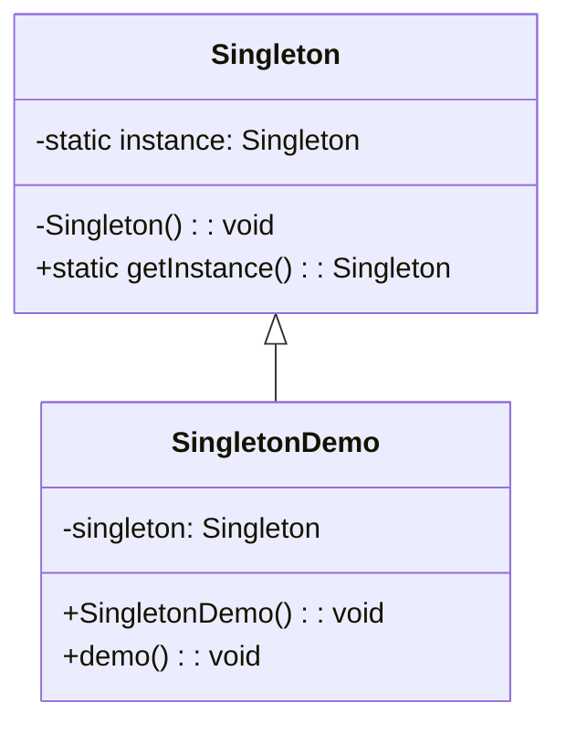

# Singleton Design Pattern

## Vấn đề
- Trong quá trình phát triển phần mềm, lập trình viên thường gặp phải tình huống cần đảm bảo rằng một lớp chỉ có một thể hiện (instance) và cung cấp một cách truy cập toàn cục đến nó.
- Điều này thường được gặp trong các tình huống như: quản lý kết nối cơ sở dữ liệu, cửa sổ đăng nhập...

## Giải pháp

- Để giải quyết vấn đề trên, chúng ta có thể sử dụng `Singleton Design Pattern`. 
- Pattern này đảm bảo rằng một lớp chỉ có một thể hiện và cung cấp một điểm truy cập toàn cục đến nó.
- Khi áp dụng `Singleton Pattern`, chúng ta có thể kiểm soát số lượng thể hiện của một lớp, đảm bảo rằng không có hai thể hiện nào của lớp đó tồn tại cùng một thời điểm. Điều này giúp tiết kiệm tài nguyên hệ thống và đảm bảo tính nhất quán trong quá trình thao tác với thể hiện của lớp.

## Một số ví dụ thực tế

Singleton Pattern có thể được sử dụng trong các tình huống sau:
- **Logger Classes**: `Singleton Pattern` giúp đảm bảo rằng tất cả các thông điệp log đều được ghi vào cùng một nơi.
- **Configuration Classes**: `Singleton Pattern` đảm bảo rằng tất cả các phần của ứng dụng đều sử dụng cùng một cấu hình.
- **Accesing resources in shared memory**: `Singleton Pattern` giúp đảm bảo rằng không có hai thể hiện nào cùng truy cập vào cùng một tài nguyên trong bộ nhớ chia sẻ.
- **Database connections**: `Singleton Pattern` giúp giảm thiểu số lượng kết nối đến cơ sở dữ liệu, giúp tăng hiệu suất của ứng dụng.

## Khái niệm

- `Singleton` là một design pattern thuộc nhóm *Creational Pattern*. `Singleton Pattern` giúp giảm thiểu việc khởi tạo các đối tượng không cần thiết và giúp tiết kiệm tài nguyên hệ thống.

- Sơ đồ UML của `Singleton Pattern`:



## Code
Dưới đây là ví dụ về `Singleton Pattern` trong C++ và Golang.

**C++**
```cpp
#include <iostream>

// Singleton class
class Singleton {
private:
    // Private static instance
    static Singleton* instance;

    // Private constructor
    Singleton() {}

public:
    // Public static method to get the instance
    static Singleton* getInstance() {
        // If instance is null, create a new one
        if (instance == 0) {
            instance = new Singleton();
        }
        // Return the instance
        return instance;
    }

    // Method to show a message
    void showMessage() {
        std::cout << "Hello World!" << std::endl;
    }
};

// Initialize the instance as null
Singleton* Singleton::instance = 0;

int main() {
    // Get the Singleton instance
    Singleton* singleton = Singleton::getInstance();
    // Use the instance to show a message
    singleton->showMessage();
    return 0;
}
```

**Golang**
```go
package main

import (
	"fmt"
	"sync"
)

// Singleton struct
type singleton struct{}

// Private instance
var instance *singleton
var once sync.Once

// Function to get the instance
func getInstance() *singleton {
	once.Do(func() {
		instance = &singleton{}
	})
	return instance
}

// Method to show a message
func (s *singleton) showMessage() {
	fmt.Println("Hello World!")
}

func main() {
	// Get the Singleton instance
	s := getInstance()
	// Use the instance to show a message
	s.showMessage()
}
```

## Ưu nhược điểm

### Ưu điểm
- Đảm bảo rằng một lớp chỉ có một thể hiện.
- Cung cấp một cách truy cập toàn cục đến thể hiện đó.

### Nhược điểm
- Vi phạm nguyên lý Single Responsibility khi quản lý việc tạo và duy trì chính nó.
- Nếu sử dụng không đúng cách, Singleton có thể gây ra các vấn đề về đa luồng.

## So sánh với các design pattern khác
- `Factory Pattern` tập trung vào việc tạo ra một thể hiện của lớp, trong khi `Singleton` đảm bảo rằng chỉ có một thể hiện của lớp được tạo ra.
- `Prototype Pattern` được sử dụng khi việc tạo một thể hiện mới của một lớp là quá tốn kém, trong khi `Singleton` được sử dụng để đảm bảo chỉ có một thể hiện của lớp.

### First tabs




```php
var_dump('hello');
```



```javascript
console.log('hello');
```



```javascript
pputs 'hello'
```




### Second tabs




```yaml
hello:
  - 'whatsup'
  - 'hi'
```



```json
{
    "hello": ["whatsup", "hi"]
}
```



