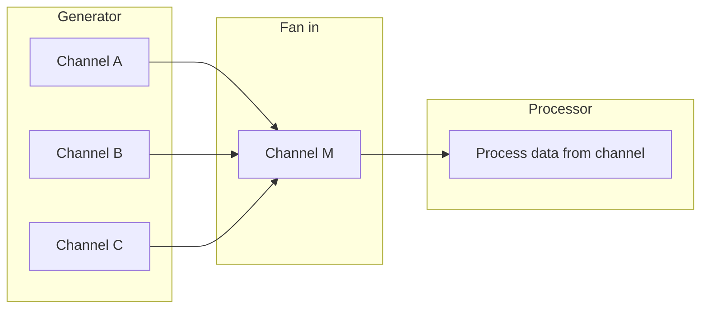
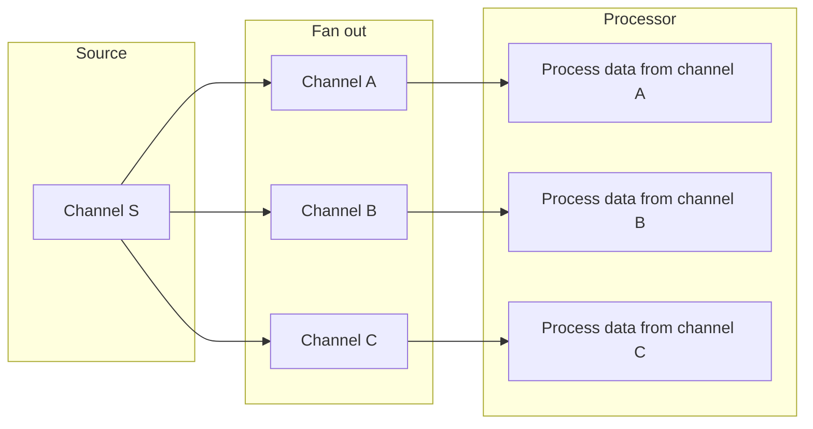

# Go Concurrency Patterns

## Golang Goroutine và Channel

### Goroutine

- `Goroutine` là một trong những đặc trưng nổi bật nhất của ngôn ngữ lập trình Go. 
- Chúng là các luồng thực thi nhẹ (lightweight execution thread), trái với các luồng thông thường do hệ điều hành quản lý, `Goroutine` được quản lý bởi Go runtime. Điều này giúp giảm bớt chi phí liên quan đến việc khởi tạo và chuyển đổi ngữ cảnh (context switching), làm cho `Goroutine` "nhẹ" hơn và khởi động nhanh hơn so với các luồng thông thường.
- `Go Scheduler` là một phần của `Go runtime`, nó quản lý việc thực thi của các `Goroutine`. 
  - `Go Scheduler` sử dụng mô hình M:N, trong đó M `Goroutine` chạy trên N luồng hệ điều hành. Điều này cho phép lập trình viên tạo ra hàng ngàn `Goroutine` mà không phải lo lắng về việc sử dụng quá nhiều tài nguyên hệ thống.
  - `Go Scheduler` không sử dụng mô hình preemptive, nghĩa là một `Goroutine` sẽ tiếp tục chạy cho đến khi nó hoàn thành, bị chặn, hoặc tình nguyện nhường quyền điều khiển. Điều này giúp giảm bớt chi phí liên quan đến việc chuyển đổi ngữ cảnh.
- Dưới đây là một ví dụ đơn giản về cách sử dụng `Goroutine` trong Go:
  
  ```go
  package main
  
  import (
  	"fmt"
  	"time"
  )
  
  func say(s string) {
  	for i := 0; i < 5; i++ {
  		time.Sleep(100 * time.Millisecond)
  		fmt.Println(s)
  	}
  }
  
  func main() {
  	go say("world")
  	say("hello")
  }
  ```

- Trong ví dụ trên, chúng ta tạo ra một Goroutine mới bằng cách sử dụng từ khóa `go`. Hàm `say("world")` sẽ chạy đồng thời với hàm `say("hello")`.

### Channel

- `Channel` trong Golang là một cơ chế cho phép hai hoặc nhiều goroutine có thể trao đổi dữ liệu với nhau và đồng bộ hóa việc thực thi của chúng.
- Hoạt động theo mô hình "First In First Out" (FIFO). Điều này có nghĩa là dữ liệu được gửi đến channel sẽ được lưu trữ trong một hàng đợi, và mỗi lần một goroutine khác đọc dữ liệu từ channel, dữ liệu đầu tiên trong hàng đợi sẽ được lấy ra.
- Channel có thể được tạo ra bằng cách sử dụng từ khóa `make` và có thể chứa các giá trị của bất kỳ kiểu dữ liệu nào. Một channel có thể được đóng lại để ngăn không cho gửi thêm dữ liệu nữa bằng cách sử dụng từ khóa `close`.
- Dưới đây là một ví dụ đơn giản về cách sử dụng channel trong Go:
  
  ```go
  package main
  
  import (
  	"fmt"
  )
  
  func main() {
  	messages := make(chan string)
  
  	go func() {
  		messages <- "hello"
  	}()
  
  	msg := <-messages
  	fmt.Println(msg)
  }
  ```

- Trong ví dụ trên, chúng ta tạo ra một channel mới tên là `messages`. Sau đó, chúng ta tạo ra một goroutine mới, trong đó chúng ta gửi chuỗi "hello" vào channel. Cuối cùng, chúng ta đọc dữ liệu từ channel và in ra màn hình.
- Ví dụ sau minh họa cách sử dụng Goroutine và Channel để tính tổng các số từ 1 đến 10:
  
  ```go
  package main
  
  import (
  	"fmt"
  )
  
  func sum(nums []int, c chan int) {
  	sum := 0
  	for _, n := range nums {
  		sum += n
  	}
  	c <- sum // gửi tổng vào channel
  }
  
  func main() {
  	nums := []int{1, 2, 3, 4, 5, 6, 7, 8, 9, 10}
  	c := make(chan int) // tạo channel kiểu int
  	go sum(nums[:5], c) // khởi tạo goroutine tính tổng nửa đầu
  	go sum(nums[5:], c) // khởi tạo goroutine tính tổng nửa sau
  	x, y := <-c, <-c     // nhận hai giá trị từ channel
  	fmt.Println(x, y, x+y) // in ra kết quả
  }
  ```

## Một số concurrency pattern phổ biến

### Fan-in

- Cho phép hợp nhất kết quả từ nhiều channel vào một channel duy nhất



```go
package main

import (
	"fmt"
	"sync"
)

// fanIn nhận dữ liệu từ nhiều kênh và gửi vào một kênh duy nhất
func fanIn(chans ...<-chan int) <-chan int {
	out := make(chan int)
	var wg sync.WaitGroup
	wg.Add(len(chans))
	for _, ch := range chans {
		go func(c <-chan int) {
			for n := range c {
				out <- n
			}
			wg.Done()
		}(ch)
	}
	go func() {
		wg.Wait()
		close(out)
	}()
	return out
}

// generator tạo ra một kênh gửi các số từ start đến end
func generator(start, end int) <-chan int {
	out := make(chan int)
	go func() {
		for i := start; i <= end; i++ {
			out <- i
		}
		close(out)
	}()
	return out
}

func main() {
	// tạo ra ba kênh gửi các số từ 1 đến 10, từ 11 đến 20 và từ 21 đến 30
	c1 := generator(1, 10)
	c2 := generator(11, 20)
	c3 := generator(21, 30)

	// gọi hàm fanIn để nhận dữ liệu từ ba kênh trên và gửi vào một kênh duy nhất
	c := fanIn(c1, c2, c3)

	// in ra các số nhận được từ kênh c
	for n := range c {
		fmt.Println(n)
	}
}
```

### Fan-out

- Cho phép dữ liệu đọc từ một channel được gửi ra nhiều channel khác nhau



```go
package main

import (
	"fmt"
	"time"
)

// fanOut gửi dữ liệu từ một kênh vào nhiều kênh khác nhau
func fanOut(in <-chan int, n int) []<-chan int {
	// tạo ra một slice chứa n kênh
	out := make([]<-chan int, n)
	for i := 0; i < n; i++ {
		// tạo ra một kênh cho mỗi phần tử trong slice
		out[i] = make(chan int)
		// khởi chạy một goroutine để gửi dữ liệu từ kênh in vào kênh out[i]
		go func(c chan int) {
			for n := range in {
				c <- n
			}
			close(c)
		}(out[i].(chan int))
	}
	return out
}

// generator tạo ra một kênh gửi các số từ start đến end
func generator(start, end int) <-chan int {
	out := make(chan int)
	go func() {
		for i := start; i <= end; i++ {
			out <- i
		}
		close(out)
	}()
	return out
}

// worker nhận dữ liệu từ một kênh và in ra màn hình
func worker(id int, in <-chan int) {
	for n := range in {
		fmt.Printf("Worker %d received %d\n", id, n)
		time.Sleep(time.Second) // giả lập thời gian xử lý
	}
}

func main() {
	// tạo ra một kênh gửi các số từ 1 đến 10
	c := generator(1, 10)

	// gọi hàm fanOut để gửi dữ liệu từ kênh c vào ba kênh khác nhau
	chans := fanOut(c, 3)

	// khởi chạy ba goroutine làm nhiệm vụ worker để nhận dữ liệu từ ba kênh trên
	for i := 0; i < 3; i++ {
		go worker(i+1, chans[i])
	}

	// đợi ba giây để các goroutine hoàn thành công việc
	time.Sleep(3 * time.Second)
}
```

### Pipeline

- Một loạt các giai đoạn kết nối bởi các channel, trong đó mỗi giai đoạn là một nhóm các goroutine chạy cùng một hàm.
- Mỗi giai đoạn nhận giá trị từ các channel đầu vào, thực hiện một số chức năng trên dữ liệu đó, thường tạo ra các giá trị mới, và gửi trả các giá trị qua các channel đầu ra.

  ```mermaid
  graph LR
      subgraph Source
          A[Generate data] --> B[Send to channel]
      end
      subgraph Stage 1
          B --> C[Receive and process data]
          C --> D[Send to channel]
      end
      subgraph Stage 2
          D --> E[Receive and process data]
          E --> F[Send to channel]
      end
      subgraph Sink
          F --> G[Receive and consume data]
      end
  ```


  ```go
  package main
  
  import (
  	"fmt"
  	"math/rand"
  	"time"
  )
  
  // gen là một hàm chuyển đổi một danh sách các số nguyên thành một channel
  // trả ra các số nguyên trong danh sách đó.
  // Hàm gen bắt đầu một goroutine gửi các số nguyên trên channel
  // và đóng channel khi tất cả các giá trị đã được gửi.
  func gen(nums ...int) <-chan int {
  	out := make(chan int)
  	go func() {
  		for _, n := range nums {
  			out <- n
  		}
  		close(out)
  	}()
  	return out
  }
  
  // sq nhận các số nguyên từ một channel và trả về một channel
  // trả ra bình phương của mỗi số nguyên nhận được.
  // Sau khi channel đầu vào được đóng và giai đoạn này đã gửi tất cả các giá ra channel output,
  // nó đóng channel đầu ra.
  func sq(in <-chan int) <-chan int {
  	out := make(chan int)
  	go func() {
  		for n := range in {
  			out <- n * n
  		}
  		close(out)
  	}()
  	return out
  }
  
  func main() {
  	// Thiết lập pipeline và nhận giá trị đầu ra.
  	for n := range sq(sq(gen(2, 3))) {
  		fmt.Println(n) // 16 rồi 81
  	}
  }
  ```
  
